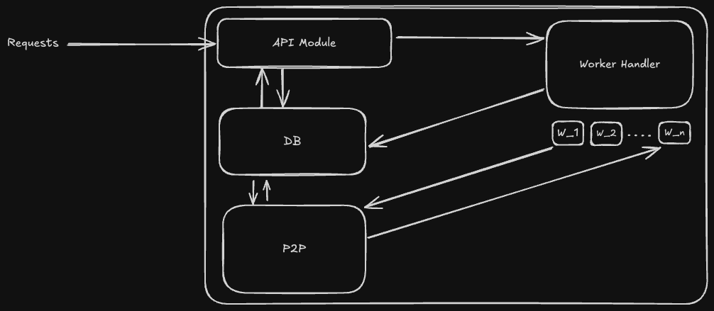
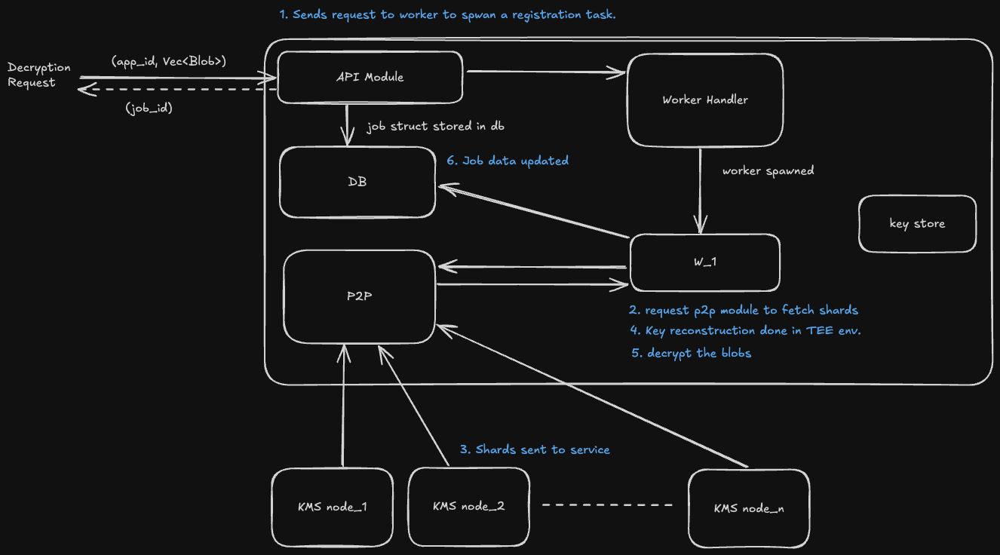

# Encryption Service

## Overview

Enigma's encryption service is a service that takes requests from turbo DA for encryption of DA blob and returning the encrypted blob to turbo DA.

## Components

- **API**: The API is the API that takes requests from turbo DA for registration, encryption and decryption.
- **Worker**: The worker is a program that listens to events and processes the given command. For eg: Registration and Decryption Requests.
- **P2P**: The P2P is the program that interacts with the KMS nodes to send and recieve key shards.
- **KeyGen**: The KeyGen is the program that generates the key shards and stores them in files.

## Flows

### Registration Flow

1. The API receives a registration request from turbo DA.
2. The API sends a message to worker handler to register the app with details and returns a job ID.
3. The spawned worker will generate the key shards and sends it to the P2P KMS nodes and deletes the shards from TEE environment.
4. On Turbo DA side, the polling worker will wait for the job ID to be complete by querying the job status from the API.

### Encryption Flow

1. The API receives an encryption request from turbo DA.
2. The logic encrypts the DA blob and returns the encrypted blob to turbo DA.

### Decryption Flow

1. The API receives a decryption request from turbo DA.
2. The API sends a message to worker handler to decrypt the DA blob and returns a job ID.
3. The spawned worker will fetch the key shards from the P2P KMS nodes and the key is reconstructed in the TEE environment.
4. The logic decrypts the DA blobs and stores the decrpyted blob with the job ID in the database.
5. On Turbo DA side, the polling worker will wait for the job ID to be complete by querying the job status from the API.
