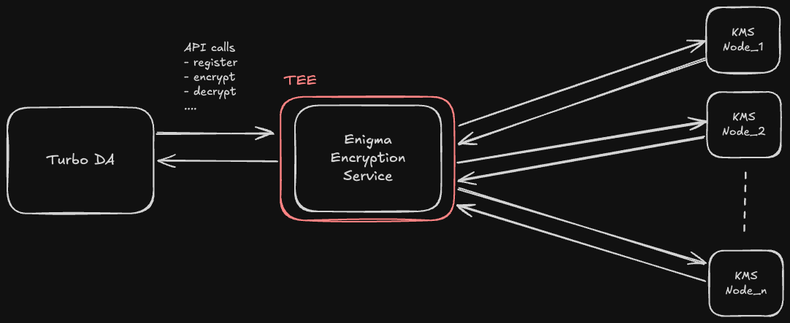

# Enigma DA Service

## Overview

Enigma's DA service is a service that takes requests from turbo DA for encryption of DA blob and submission to Avail DA.

## Components Index

- [Encryption Service](./encryption-service.md)
- [KMS Nodes](https://github.com/RizeLabs/enigma-kms-node/blob/main/Readme.md)

## High Level Architecture

### Components

- **Enigma Encryption Service**: The encryption service is the main service that takes requests from turbo DA for encryption of DA blob.
- **Turbo DA**: The turbo DA is the service that takes requests from the user for submission of DA to Avail DA.
- **KMS Nodes**: The KMS nodes are the nodes that are used to store the key shards that are used to form the priavte key on the service's side that is used to encrypt the DA blob.
