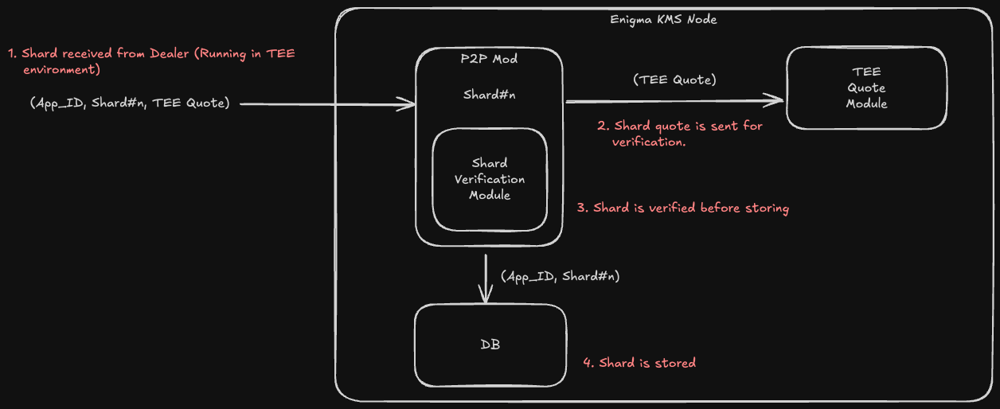
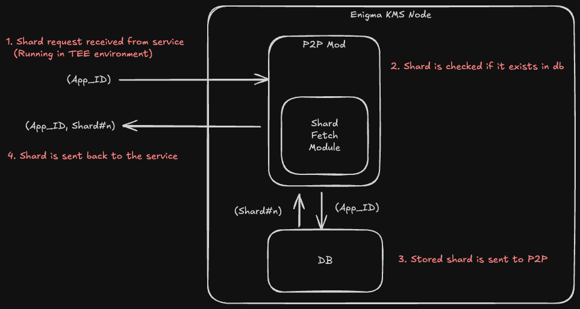

# Enigma KMS Node

Enigma KMS Node is a node that is responsible for receiving and sending shards
to and from the dealer/service (Running in TEE environment).

## Setup

- [Setup](./docs/setup.md)

## Shard Receiving Flow

1. Node receives a shard from the dealer (Running in TEE environment)
2. Shard consists of :
    - App ID
    - Shard Index
    - Shard Data
    - TEE Quote
3. Node will verify the shard quote.
4. If the shard is valid, node will store the shard in the local
storage after verifying the shard.
5. Node will send an acknowledgement to the dealer.

## Shard Request Flow

1. Node receives a request from the service (Running in TEE environment).
2. Node checks if shard is present in local storage.
3. If shard is present, node will send the shard to the service.

## Extra Docs

- [Generating Expected MR values](./docs/genrating_expected_mr_vals.md)
- [Verifying Quote](./docs/verifying_quote.md)
